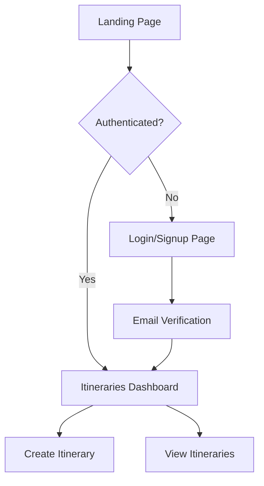

# Disney Trip Planner - Architecture & User Flow Documentation

## Overview
The Disney Trip Planner is a Next.js web application that helps users create and manage personalized Disney park itineraries. It uses Supabase for authentication and data storage, and OpenAI's GPT-4 for generating intelligent itineraries.

## Technical Stack

### Frontend
- **Framework**: Next.js 14 with App Router
- **UI Components**: Custom components built with Radix UI and styled with Tailwind CSS
- **State Management**: React hooks and context
- **Styling**: Tailwind CSS with custom theme configuration

### Backend
- **Database**: Supabase (PostgreSQL)
- **Authentication**: Supabase Auth
- **AI Integration**: OpenAI GPT-4o/o1
- **Deployment**: Docker containerization with multi-stage builds

## Core Features

### 1. Authentication System
- Email-based authentication
- Invitation-only signup system
- Protected routes for authenticated users
- Admin-specific features

### 2. Itinerary Management
- Create new itineraries
- View existing itineraries
- Update itineraries in real-time
- Delete itineraries

### 3. AI-Powered Itinerary Generation
- Customized itinerary creation based on user preferences
- Real-time itinerary updates
- Park-specific recommendations
- Intelligent scheduling

## User Flow

### 1. Authentication Flow



### 2. Itinerary Creation Flow
1. User navigates to "Create Itinerary"
2. Fills out preferences form:
   - Park selection
   - Visit date
   - Group size
   - Preferences (pace, special passes)
3. System generates personalized itinerary using GPT-4
4. Itinerary is saved to database
5. User is redirected to view the new itinerary

### 3. Itinerary Management Flow
1. Users can view all their itineraries on the dashboard
2. Each itinerary can be:
   - Viewed in detail
   - Updated in real-time
   - Deleted
   - Marked as completed

## Directory Structure

```
src/
├── app/ # Next.js app router pages
│ ├── (auth-pages)/ # Authentication related pages
│ ├── api/ # API routes
│ └── protected/ # Protected routes
├── components/ # Reusable UI components
├── utils/ # Utility functions
├── hooks/ # Custom React hooks
└── lib/ # Shared libraries
```


## Key Components

### 1. Layout Components
- `NavBar`: Main navigation component
- `Card`: Reusable card component for consistent UI
- `Dialog`: Modal dialogs for user interactions

### 2. Form Components
- `CreateItineraryForm`: Main form for itinerary creation
- Custom form controls (Input, Select, etc.)

### 3. Feature Components
- `ItineraryContent`: Displays itinerary details
- `ItinerariesList`: Lists user's itineraries

## Data Flow

1. **User Input** → Form submission
2. **API Route** → Processes request
3. **OpenAI API** → Generates itinerary
4. **Supabase** → Stores data
5. **Client** → Renders response

## Deployment

### Docker Configuration
- Multi-stage build process
- Production optimization
- Environment variable management
- Standalone output

### Environment Setup
Required environment variables:
- `NEXT_PUBLIC_SUPABASE_URL`
- `NEXT_PUBLIC_SUPABASE_ANON_KEY`
- `OPENAI_API_KEY`
- `INVITE_CODE`

## Security Considerations

1. **Authentication**
   - Protected routes
   - Invitation-only signup
   - Server-side session validation

2. **API Security**
   - Rate limiting
   - Input validation
   - Protected API routes

3. **Data Security**
   - Encrypted storage
   - Secure environment variables
   - Role-based access control

## Future Considerations

1. **Scalability**
   - Caching layer for frequently accessed data
   - API optimization
   - Database indexing

2. **Features**
   - Real-time collaboration
   - Mobile app version
   - Offline support
   - Integration with Disney's official API

3. **Performance**
   - Image optimization
   - Code splitting
   - Progressive loading